# 🚀 SCOPE: **S**calable **C**omprehensive **O**bservability **P**latform with **e**BPF

[](LICENSE)
[](https://go.dev/)
[](https://ebpf.io/)
[](https://redis.io/)
[](https://www.timescale.com/)
[](https://github.com/go-chi/chi)


> 基于 eBPF 的可扩展综合可观测性平台 - 非侵入、即插即用、高性能、分布式系统监控解决方案


## 📊 项目概述

SCOPE 是一个高性能、非侵入的分布式系统可观测性平台，专注于使用 eBPF 技术监控复杂系统行为和 LLM 推理应用行为。它的核心优势在于能够深度监控 CUDA runtime 库 和 AI 推理工作负载（如 Ollama/llama.cpp/ggml），而无需修改目标应用的代码。

通过分布式的设计, SCOPE 可以实现多节点监控, 通过消息队列实现高性能的可靠数据传输, 通过 TimescaleDB 时序数据库实现高效的时间序列数据存储和查询。 前端界面则通过 Vue 框架实现, 并结合 Grafana 和 Perfetto 实现多维度数据可视化。

### ✨ 核心优势

- **深度 GPU 监控**: 通过 eBPF uprobes 精确跟踪 CUDA 运行时库调用，包括显存分配、数据传输和CUDA 内核函数执行。 通过 libbpf 实现高性能的 eBPF 探针, 利用 CORE(Compile Once – Run Everywhere) 技术。
- **AI 模型性能分析**: 特别优化的 GGML 库探针，可跟踪 LLM 推理性能瓶颈
- **高效数据管道**: 使用 Ring Buffer 和 ZeroMQ 构建的高吞吐量数据采集管道
- **时序数据分析**: 集成 TimescaleDB 时序数据库实现高效的时间序列数据存储和查询
- **分布式架构**: 支持多机器监控，通过 Redis Streams 实现可靠的数据传输
- **JWT 双 Token 认证**: 实现了现代化的访问令牌和刷新令牌机制

### 🔧 技术架构

SCOPE 采用多层架构，包括：

1. **数据采集层**: eBPF 程序 (C/libbpf) 通过 uprobes/kprobes 无侵入地挂载到目标进程
2. **数据传输层**: 使用 Ring Buffer 和 ZeroMQ 实现高效数据传输
3. **数据处理层**: Go 后端服务处理和转换数据，并存储到 TimescaleDB 和 PostgreSQL
4. **API 层**: 基于 Chi 框架的 RESTful API，支持 JWT 认证
5. **可视化层**: 集成 Grafana 和 Perfetto 实现多维度数据可视化

### 🏗️ 部署架构

SCOPE 支持多种部署方式：

1. **开发环境部署**:
   - 使用 Docker Compose 部署 TimescaleDB 和 Redis
   - 本地运行后端服务和 Agent 管理器

2. **生产环境部署**:
   - 数据库层: TimescaleDB 和 Redis 集群
   - 后端服务: 可通过 Nginx 反向代理实现负载均衡
   - Agent 管理器: 在各监控节点上通过 Systemd 服务运行

## 🔎 核心功能与实现

### 📡 eBPF 探针技术

- **CUDA 运行时监控**
  - 深度监控 CUDA API: cudaMalloc, cudaFree, cudaMemcpy, cudaLaunchKernel, cudaDeviceSynchronize
  - 精确跟踪显存分配、释放、数据传输和内核执行

- **GGML 与 LLM 推理监控**
  - 专门为 Ollama/llama.cpp 设计的探针，跟踪关键函数：
    - `ggml_cuda_op_mul_mat_vec_q`: 矩阵-向量乘法操作（AI 推理的核心）
    - `ggml_graph_compute`: 计算图执行（模型推理的主要步骤）
    - `ggml_cuda_pool_vmm`: 显存管理监控

- **系统调用与进程监控**
  - 实现了全系统调用跟踪 (syscalls)
  - 进程创建与执行跟踪 (execv)
  - 进程调度监控 (sched_wakeup, sched_switch)
  - 文件系统操作跟踪 (vfs_open)

- TODO: 
  - More probes are on the fly.


### 💹 高效数据管道


- **多级数据缓冲与传输**
  - eBPF Ring Buffer: 内核到用户空间的高效数据传输
  - ZeroMQ: 将数据从 libbpf C 程序传输到 golang 的 agent 管理
  - Redis Streams: 节点 agent 端传输到中心后端, 实现可靠的消息队列与流处理, 并大幅提高开发效率

- **高性能数据处理**
  - 多消费者并行处理模型
  - 批量插入与事务处理
  - 基于 CPU 核心数量的自适应扩展

### 🔐 现代化身份认证

- **JWT 双 Token 机制**
  - 短期访问令牌 (Access Token): 验证 API 请求
  - 长期刷新令牌 (Refresh Token): 无需重新登录即可更新访问令牌
  - Redis 存储令牌状态，支持即时失效

- **RESTful API 设计**
  - 基于 Chi 路由器的清晰 API 结构
  - 完整的中间件支持: CORS、日志、恢复、认证
  - Swagger 文档自动生成

## 🛠️ 技术栈


| 层次 | 技术 | 优势 |
|-------|------|------|
| **数据采集** | libbpf, eBPF | 内核级性能监控，零侵入 |
| **数据传输** | Ring Buffer, ZeroMQ, Redis Streams | 高吞吐量，可靠性 |
| **数据存储** | TimescaleDB, PostgreSQL | 高性能时序数据存储 |
| **API 服务** | Go, Chi Router, JWT | 高并发，现代化认证 |
| **可视化** | Grafana, Perfetto | 多维度数据分析 |

### 后端技术详情

- **Go 生态系统**
  - Chi: 轻量级、高性能 HTTP 路由器
  - pgx/sqlx: 高性能 PostgreSQL 驱动
  - go-redis: Redis 客户端与 Streams 支持
  - swaggo: API 文档自动生成

- **数据处理管道**
  - libbpf (C): 内核 eBPF 程序开发
  - ZeroMQ: 高性能消息传输
  - Redis Streams: 可靠消息队列
  - TimescaleDB: 时序数据专用数据库

## 🚀 快速开始

### 系统要求

- Linux 内核
- Go 1.21+
- Docker 和 Docker Compose
- CUDA 库 (如需监控 GPU 应用)
- 构建依赖:
  - git
  - build-essential
  - clang
  - llvm
  - libelf-dev
  - libbpf-dev
  - libzmq3-dev
  - libmsgpack-dev
- 前端构建依赖:
  - pnpm


### 部署步骤

```bash
# 1. 克隆仓库
git clone https://github.com/Delta-in-hub/ebpf-golang.git
cd ebpf-golang

# 2. 配置环境变量
cp .env.example .env
# 编辑 .env 文件设置数据库连接、JWT 密钥等

# 3. 构建各个组件

# 构建 eBPF 程序和 Agent 管理器
./scripts/build-agent.sh

# 构建后端服务
./scripts/build-backend.sh

# 构建前端界面
./scripts/build-frontend.sh

# 4. 使用 Docker 部署数据库和 Redis
cd deploy
docker-compose up -d

# 5. 启动后端服务
./scope-backend

# 6. 在需要监控的节点上启动 Agent 管理器
sudo ./scope-agent-manager
```

## 📚 项目结构

```
├── bpf/                   # eBPF 程序源码
│   ├── cuda/              # CUDA 运行时监控探针
│   ├── ggml_cuda/         # GGML CUDA 监控探针
│   ├── ggml_base/         # GGML 基础库监控
│   ├── ggml_cpu/          # GGML CPU 监控探针
│   ├── Ollamabin/         # Ollama 二进制监控
│   ├── syscalls/          # 系统调用监控
│   ├── execv/             # 进程执行监控
│   ├── sched/             # 进程调度监控
│   └── vfs_open/          # 文件系统操作监控
├── cmd/                   # 应用入口点
│   ├── scope-agent-manager/  # Agent 节点管理服务
│   └── scope-backend/     # 中心化后端服务
├── database/              # 数据库交互层
│   ├── postgres/          # PostgreSQL/TimescaleDB 交互
│   └── redis/             # Redis 交互与 Streams 处理
├── deploy/                # 部署配置文件
│   ├── docker/            # Docker 部署配置
│   ├── grafana/           # Grafana 仪表盘配置
│   ├── nginx/             # Nginx 配置
│   └── systemd/           # Systemd 服务配置
├── internal/              # 内部包
│   ├── agentmanager/      # Agent 管理逻辑
│   ├── backend/           # 后端服务与 API 处理
│   ├── middleware/        # JWT 认证与其他中间件
│   ├── models/            # 数据模型与序列化
│   ├── platform/          # 系统平台相关功能
│   └── utils/             # 工具函数与加密实现
├── scripts/               # 部署和管理脚本
│   ├── build-agent.sh     # 构建 eBPF 程序和 Agent 管理器
│   ├── build-backend.sh   # 构建后端服务
│   ├── build-frontend.sh  # 构建前端界面
│   ├── runallbpf.sh       # 运行所有 eBPF 程序
│   └── swagger.sh         # 生成 Swagger 文档
└── web/                   # Vue前端
```

##  主要功能与特点


- 对监控节点进行监控, 即插即用, 无需修改应用代码; 

- 当不需要监控时, probe 卸载, 不会有任何性能开销. ***You don't pay for what you don't use*.**


- 登陆页面

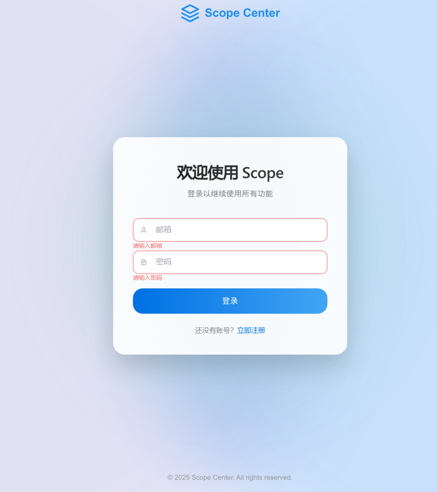

- 注册页面

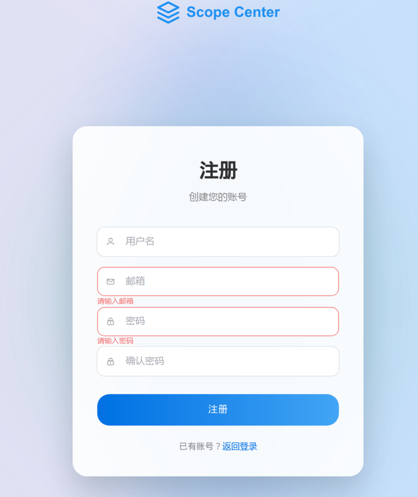


- 分布式监控节点检测

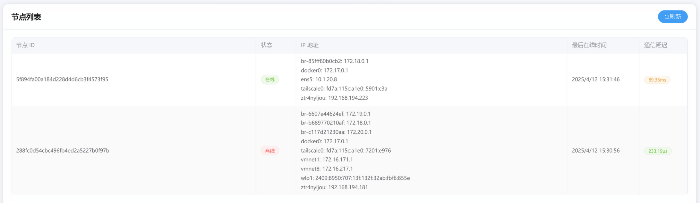


- 探测信息可视化


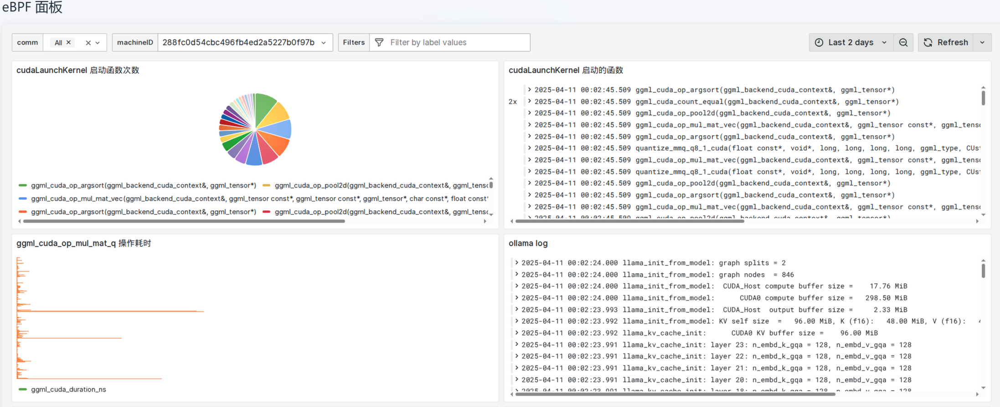


- CUDA runtime 监控

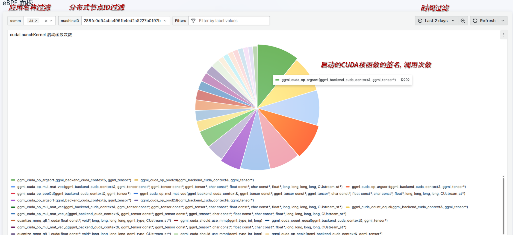


- cudaLaunchKernel 的具体信息, 符号位于哪个文件, 函数 offest 是多少, 调用该cudaLaunchKernel的进程的启动命令等

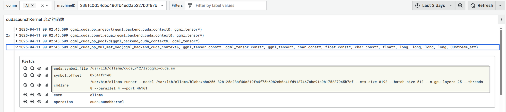

- cudaDeviceSynchronize 操作耗时 (ns)

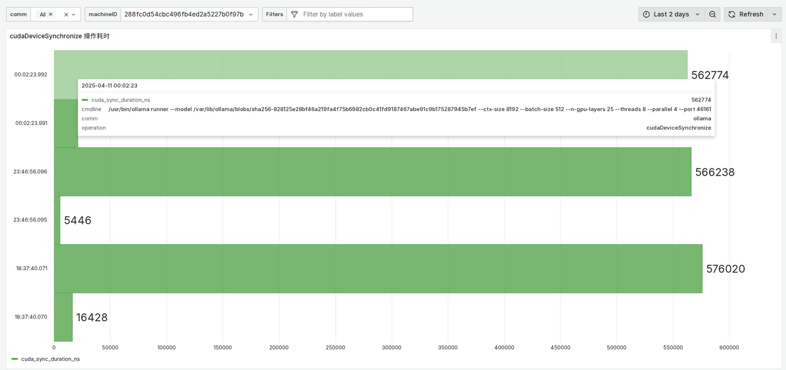

- cudaMalloc, cudaFree, cudaMemcpy 等......


- ggml 库监控

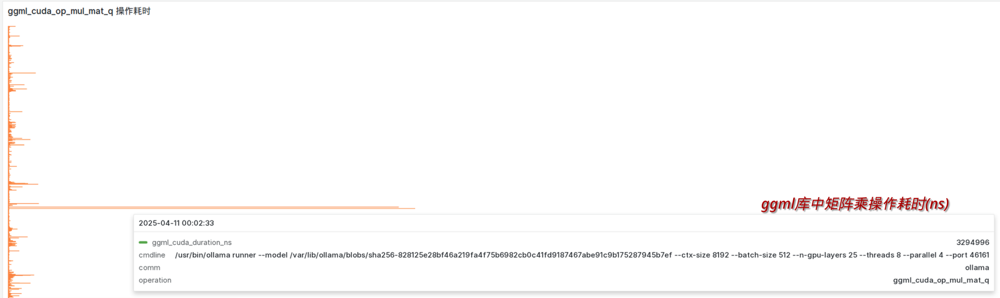


内存分配操作监控,  可用于监控/分析内存泄漏问题.

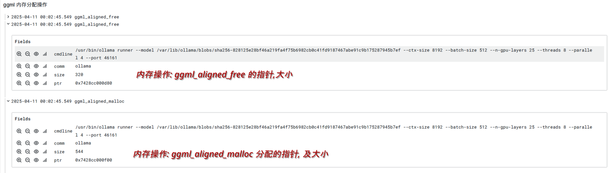


- ollama 应用监控

> Ollama is a lightweight, extensible framework for building and running language models on the local machine.


针对 ollama 应用做到针对性监控, 即插即用, 无需修改代码; 当不需要监控时, probe 卸载, 不会有任何性能开销.

***You don't pay for what you don't use*.**


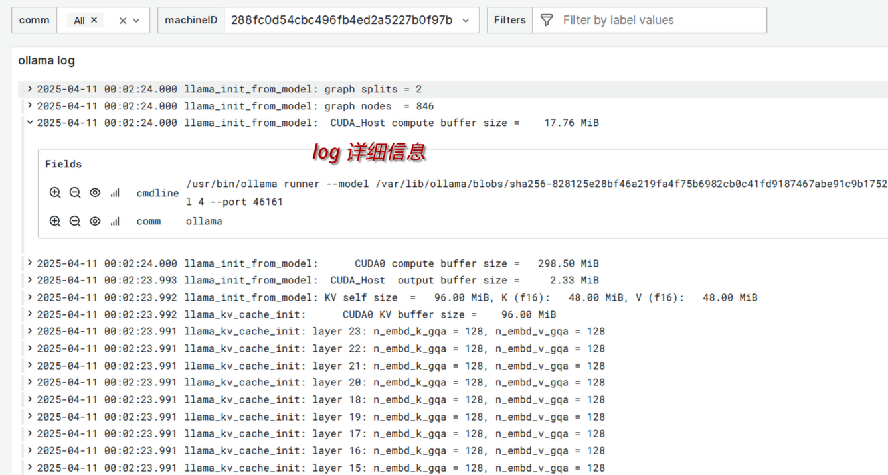


- 节点本身文件系统操作

可以通过comm筛选, 筛选出 ollama 所打开的所有文件路径, 打开时间, 命令行参数等.

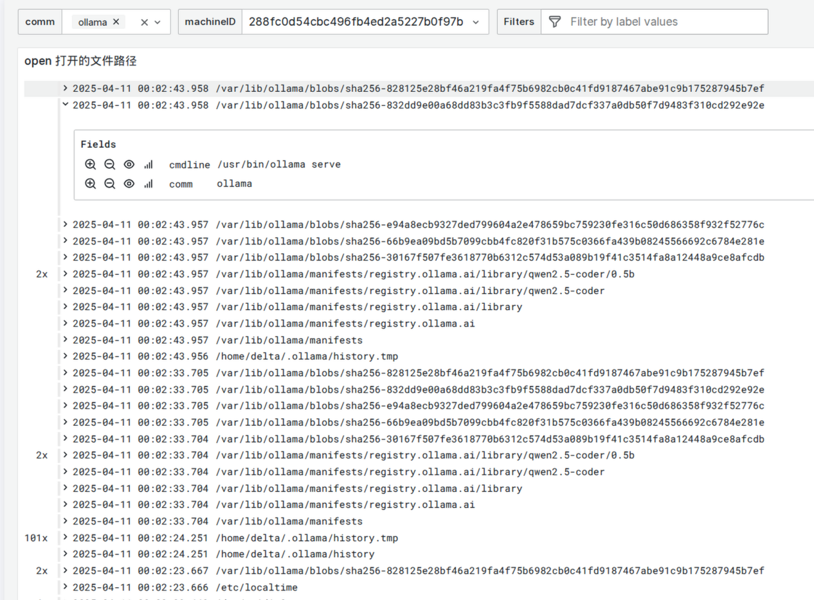

ollama 在一定时间范围内, 打开文件的次数饼图.

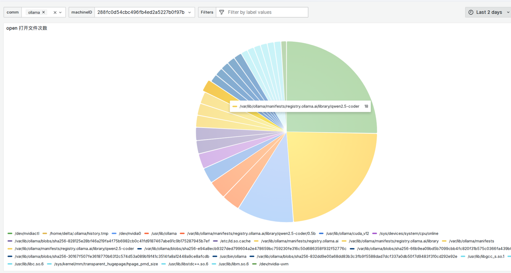


- 节点系统操作


ollama 在一定时间范围内的进程调度次数(通过监控 *sched_switch*) 

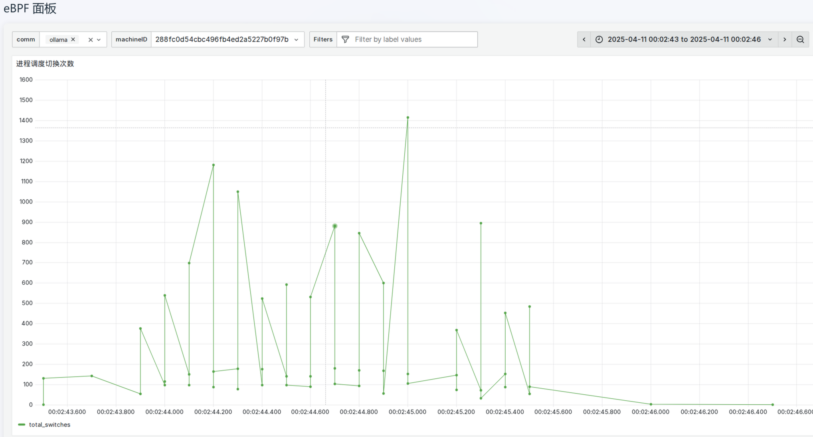


ollama 在一定时间范围内所调用的系统调用次数.

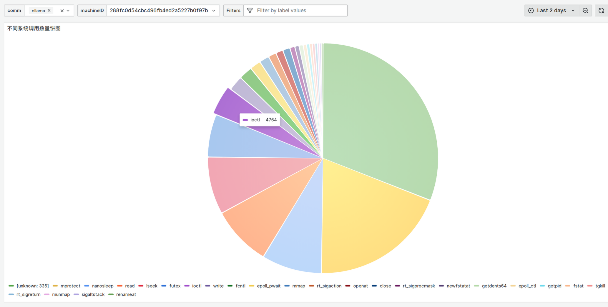


- 监控节点概览状态


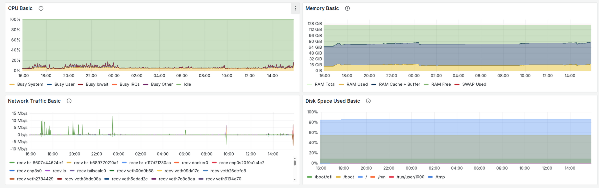


### 🔍 监控能力

- **CUDA 运行时监控**
  - 显存分配/释放跟踪，发现内存泄漏
  - 数据传输监控，分析瓶颈
  - 内核执行跟踪，性能分析

- **LLM 推理分析**
  - Ollama 和 llama.cpp 专用监控
  - GGML 库关键函数跟踪
  - 矩阵运算和计算图执行分析

- **系统调用监控**
  - 按进程 ID 或名称过滤
  - 系统调用统计和分析
  - 文件系统操作跟踪

### 📊 数据分析

- **时序数据分析**
  - 基于 TimescaleDB 的高性能时间序列存储
  - 自动数据压缩与保留策略
  - 复杂时间范围查询与聚合

- **多维度可视化**
  - Grafana 仪表盘集成
  - Perfetto 追踪视图支持
  - 自定义监控面板

## 📝 API 概览

SCOPE 提供了完整的 RESTful API，支持用户认证和监控管理。API 文档使用 Swagger 生成，部署后可访问：

```
http://localhost:18080/swagger/index.html
```

### 主要 API 组

- **/api/v1/auth**: 用户认证相关 API (登录、注册、刷新令牌)
- **/api/v1/node**: 监控节点管理 API (添加、删除、查询节点)
- **/health**: 健康检查端点

## 👥 作者

- **Delta** - [GitHub](https://github.com/Delta-in-hub)

## 📄 许可证

本项目采用 GNU General Public License v3.0 许可证 - 详情请参阅 [LICENSE](LICENSE) 文件。

🌟 如果您觉得这个项目有用，请给它一个星标! 🌟

---


